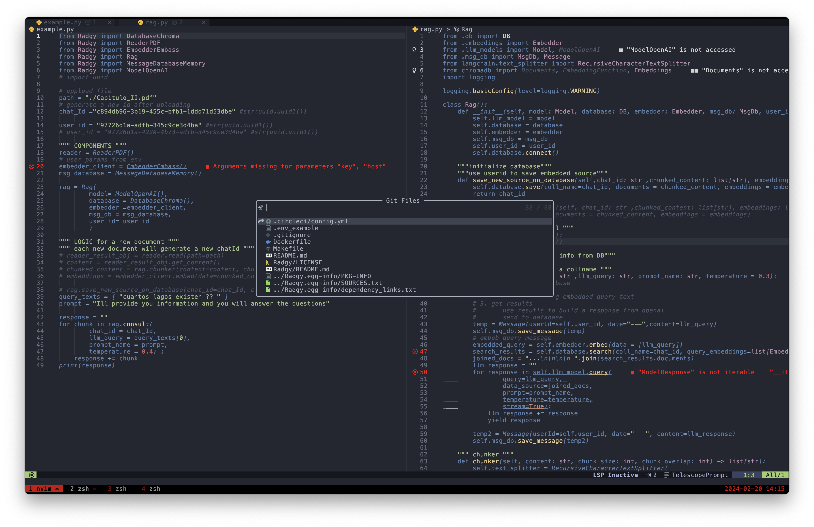

# My DotFiles

my personal configuration for professional development using java/python/golang/javascript/react

    git pull --recurse-submodules

preferred font: hack nerd

    brew install font-hack-nerd-font

Simple yet effective

- Kitty terminal
    - font, maps for tmux, titlebar 
- Tmux 
    - shortcuts, session, panes, tabs, etc
- Lunar Vim
    - IDE like enviroment for java, golang, python
    - themes

- config for iterm2 (im not using it anymore but here in case, replaced by Kitty because Kitty uses less CPU)

# useful links
 
[Kitty](https://github.com/kovidgoyal/kitty)
[Tmux](https://hamvocke.com/blog/a-quick-and-easy-guide-to-tmux/)
[LunarVim](https://www.lunarvim.org)
[Nerd Fonts](https://github.com/ryanoasis/nerd-fonts)
